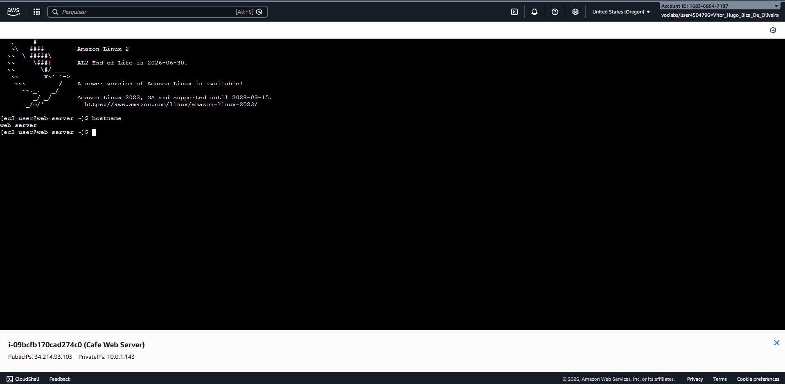

# Case Study: AWS Networking Troubleshooting & Flow Log Analysis

## 📌 Visão Geral
Este projeto documenta a resolução de um desafio técnico focado em **infraestrutura de rede na AWS**. O objetivo principal foi restaurar a conectividade de um servidor web e acesso SSH em um ambiente multi-VPC, utilizando **AWS CLI** para diagnóstico e remediação, e **VPC Flow Logs** para auditoria de tráfego.

## 🏗️ 1. Arquitetura do Desafio
O laboratório iniciou com uma estrutura de duas VPCs interconectadas. O primeiro passo foi entender a topologia da rede para identificar possíveis pontos de falha.

## 🛠️ 2. Coleta de Evidências (VPC Flow Logs)
Para não "tentar a sorte", ativei o **VPC Flow Logs** direcionando os dados para um bucket S3. Isso permitiu uma análise forense do tráfego IP.

## 📂 3. Extração e Preparação dos Dados
Como os logs são armazenados de forma compactada na AWS, utilizei comandos Linux (`gunzip`) para extrair os arquivos e prepará-los para a filtragem via terminal.

## 🔍 4. Diagnóstico e Resolução (SSH & Web)
Utilizando o comando `grep`, identifiquei pacotes com status **REJECT** na porta 22. 
* **Resolução SSH:** Removi a regra restritiva na **Network ACL (NACL)** via CLI.
* **Resolução Web:** Adicionei a rota para o Internet Gateway na **Route Table**.

## 🏁 5. Resultado Final
Com a infraestrutura devidamente corrigida, o servidor passou a responder às requisições externas, confirmando o sucesso do troubleshooting.

---
*Projeto desenvolvido durante a formação na Escola da Nuvem por Vítor Hugo Bica de Oliveira.*
